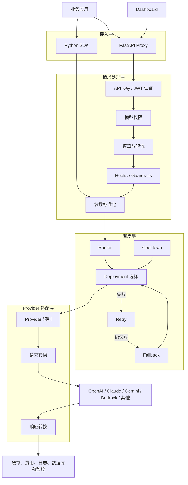
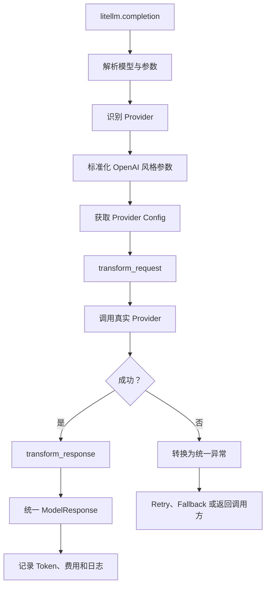
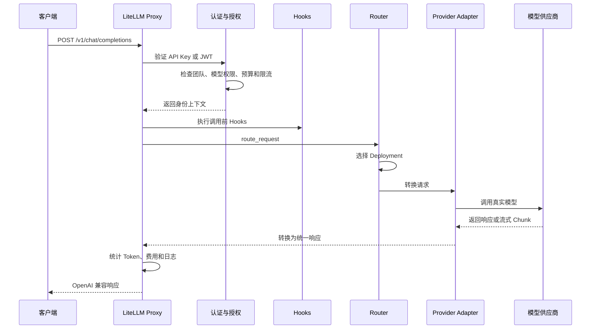
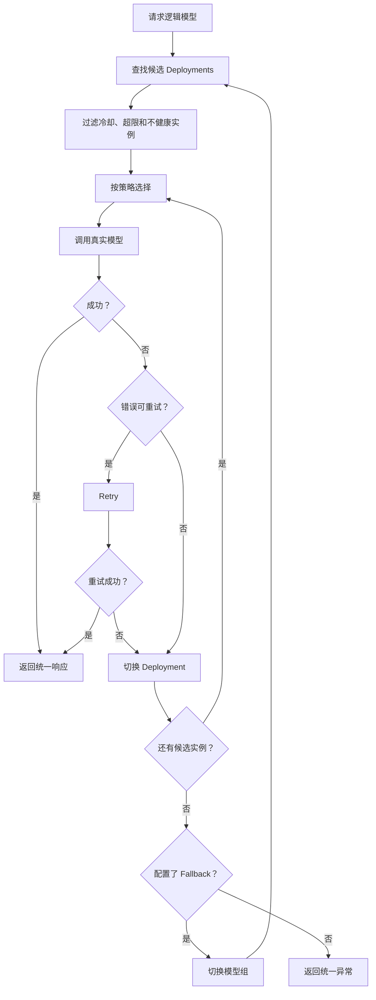
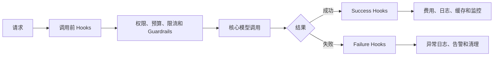
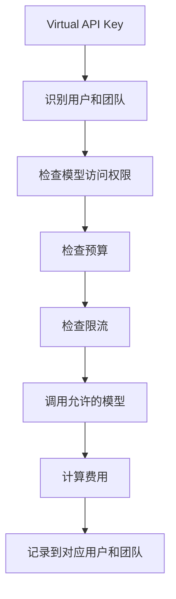
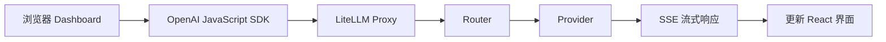

本文是 LiteLLM 三阶段学习路径的第 2 阶段。开始前建议先阅读[入门导读](./litellm-project-guide.md)；读完后可进入[动手实验](./litellm-hands-on-lab.md)，把路由与故障处理变成可观察结果。

本文关注稳定的架构关系。目录和符号基于 LiteLLM `1.100.0` 源码整理，行号和局部实现可能随版本变化，阅读时应优先搜索类名与函数名。

## 1. 五层架构

LiteLLM 可以按职责分为五层：

| 层次 | 主要职责 | 关键位置 |
| --- | --- | --- |
| 接入层 | Python API、HTTP API、Dashboard | `litellm/__init__.py`、`litellm/proxy`、`ui/litellm-dashboard` |
| 请求处理层 | 认证、权限、预算、限流、Hooks | `litellm/proxy/common_request_processing.py` |
| 调度层 | Deployment 选择、重试、回退、负载均衡 | `litellm/router.py` |
| Provider 适配层 | 请求转换、供应商调用、响应转换 | `litellm/llms` |
| 基础设施层 | 缓存、数据库、费用、日志和监控 | `litellm/caching`、`litellm/proxy/hooks`、`litellm/integrations` |



这个分层最重要的价值是职责隔离：接入层不需要实现每家供应商协议，Provider Adapter 不需要决定团队预算，业务应用也不需要感知最终 Deployment。

## 2. Python SDK 调用链

SDK 的公开入口从 `litellm/__init__.py` 导出，主要实现位于 `litellm/main.py`。常见入口包括：

- `completion()`：同步文本生成
- `acompletion()`：异步文本生成
- `image_generation()` / `aimage_generation()`：图片生成



SDK 路径和 Proxy 路径会复用大量参数标准化、Provider 识别和响应模型，但 Proxy 还需要处理远程调用方的身份与治理规则。

## 3. Proxy 请求链

Proxy 基于 FastAPI。理解聊天请求时，可以从这些位置开始：

- `litellm/proxy/proxy_server.py`：HTTP 路由
- `litellm/proxy/auth/user_api_key_auth.py`：认证与身份上下文
- `litellm/proxy/common_request_processing.py`：公共请求处理
- `litellm/proxy/route_llm_request.py`：请求分发



流式调用不会等待完整文本再返回，而是把上游 Chunk 转换成 OpenAI 兼容的 SSE 数据继续向客户端发送。错误也需要在响应开始前和流式传输中分别处理。

## 4. Model Group、Deployment 与 Router

### Model Group 是客户端契约

客户端使用逻辑模型名，例如 `customer-service-model`。这个名称应表达业务能力，而不是把某家供应商写死在业务代码中。

### Deployment 是可执行上游

每个 Deployment 描述一个真实调用目标，可能包含：

- Provider 与真实模型名
- API 地址与密钥引用
- 超时、限流与权重
- 区域、账号或版本信息

```text
customer-service-model
├── OpenAI Deployment
├── Azure Deployment A
├── Azure Deployment B
└── Anthropic Deployment
```

### Router 负责选择与恢复

Router 会结合候选实例、路由策略、限流和冷却状态选择 Deployment。



这不是对所有错误无条件重试。认证错误、无效参数、限流和网络超时的处理策略不同；错误分类和当前配置共同决定是否重试或回退。

## 5. Provider Adapter 如何统一差异

Provider Adapter 负责双向转换：

```text
OpenAI 风格请求
      ↓
Provider Config / Adapter
      ↓
Anthropic / Gemini / Bedrock 请求
      ↓
供应商响应或错误
      ↓
统一 ModelResponse / 统一异常
```

典型工作包括：

1. 判断统一参数是否被当前 Provider 支持。
2. 将 `messages`、工具调用、图片或流式参数转换为供应商格式。
3. 发送同步或异步 HTTP 请求。
4. 把响应、Token 用量和结束原因转换回统一模型。
5. 把供应商异常映射成上层可处理的错误类型。

统一层仍需保留能力边界。某个 Provider 不支持的参数不能仅靠改名获得支持；调用方应根据模型能力测试关键功能。

## 6. 关键设计模式

### 适配器模式

不同 Provider 的转换逻辑放在独立适配器中，避免业务入口堆积供应商判断。

### 策略模式

Deployment 选择算法与实际 Provider 调用分离。随机、轮询、权重、延迟或使用量都可以成为路由依据；准确的策略名称应以当前版本配置为准。

### 工厂模式

`ProviderConfigManager` 根据 Provider 和 API 类型获得 Chat、Embedding、Image、Audio 或 Video 等处理器。

工厂解决“应该获得哪个处理器”；它不等于 AOP。`Router.factory_function()` 虽然名称包含 `factory`，主要作用是按 API 调用类型创建同步或异步包装函数，并让部分调用进入通用 fallback 流程。

### AOP 风格 Hooks

认证、日志、预算、费用、Guardrails 与可观测性会横跨多个模型接口。LiteLLM 通过 Hooks、回调、FastAPI 依赖注入、装饰器和公共请求处理器，把这些横切逻辑放在模型调用前后。



称它为“AOP 风格的 Hook 与回调设计”比称为完整 AOP 框架更准确。

## 7. 多租户治理

多个用户、团队或组织可以共享一个 Proxy，同时保持权限、预算和使用记录的逻辑隔离。

```text
Organization
    ↓
Team
    ↓
User
    ↓
Virtual API Key
    ↓
End User
```

不同团队可以拥有不同的：

- Virtual API Key
- 可访问模型
- 请求限流
- 月度预算
- 消费记录
- 日志与 Guardrails



这里首先是应用层逻辑隔离，不代表每个租户天然拥有独立服务器或数据库。更高的隔离要求可能需要独立实例、数据库、网络或云账号。

## 8. Dashboard 也是 Proxy 客户端

Dashboard 位于 `ui/litellm-dashboard`，使用 Next.js 与 React。聊天调用相关代码会创建 OpenAI JavaScript 客户端，并把 `baseURL` 指向 LiteLLM Proxy。



这说明 Dashboard 没有绕过网关治理；它和其他客户端一样通过 Proxy 使用模型能力。

## 9. 图片与视频的多上游边界

Router 可以为一个逻辑图片模型配置多个 Deployment。通常是**调用前选择一个上游**，失败后再 Retry、切换 Deployment 或 Fallback，而不是同时生成多张图片再自动评选。

跨 Provider 回退时需要检查图片尺寸、宽高比、透明背景、图片编辑、参考图、URL/Base64 返回形式和计费差异。

视频生成更需要“任务归属”意识：

- 创建任务前可以选择上游。
- 创建请求明确失败时可以尝试其他上游。
- 某个上游成功接收任务后，状态查询和下载必须继续绑定原 Provider 与 Deployment。

否则可能找不到任务，或重复创建视频并产生额外费用。

## 10. 源码阅读地图

| 阅读目标 | 文件或目录 | 重点内容 |
| --- | --- | --- |
| 项目定位 | `README.md` | SDK、Proxy 与功能边界 |
| 版本和依赖 | `pyproject.toml` | Python 版本与依赖 |
| 公共 Python API | `litellm/__init__.py` | 顶层 API 导出 |
| SDK 主流程 | `litellm/main.py` | `completion()`、`acompletion()` |
| Provider 适配 | `litellm/llms` | 请求、响应与异常转换 |
| Provider Config | `litellm/utils.py` | `ProviderConfigManager` |
| Proxy 路由 | `litellm/proxy/proxy_server.py` | FastAPI 接口 |
| 公共请求流程 | `litellm/proxy/common_request_processing.py` | 请求前后处理 |
| 请求分发 | `litellm/proxy/route_llm_request.py` | `route_request()` |
| Router | `litellm/router.py` | Deployment、Retry、Fallback |
| 认证 | `litellm/proxy/auth/user_api_key_auth.py` | API Key 与 JWT |
| 成本跟踪 | `litellm/proxy/hooks/proxy_track_cost_callback.py` | 费用和预算记录 |
| Dashboard | `ui/litellm-dashboard` | 管理界面如何调用 Proxy |
| 部署 | `docker-compose.yml` | 容器编排 |
| 测试 | `tests` | Router、Provider 与 Proxy 测试 |

## 11. 一条不会迷路的阅读顺序

1. 阅读 `README.md`、`pyproject.toml` 和 `docker-compose.yml`，确认项目边界。
2. 从 `litellm/__init__.py` 进入 `litellm/main.py`，跟踪 `completion()`。
3. 选择一个 `litellm/llms` 下的 Provider，观察请求与响应转换。
4. 从 `proxy_server.py` 的 `chat_completion()` 跟踪 Proxy 请求。
5. 阅读认证、公共请求处理和 `route_request()`。
6. 跟踪 `Router.acompletion()`、Deployment 选择、Retry 与 Fallback。
7. 最后再看预算、限流、缓存、Hooks、费用、日志和 Dashboard。

每走一步都记录“输入数据、负责模块、输出数据和失败路径”。这样比逐目录通读更容易建立稳定心智模型。

## 下一步

进入[第 3 阶段：LiteLLM 动手实验](./litellm-hands-on-lab.md)，启动一个本地 Proxy，并亲自验证：

- 正常 Key 能访问逻辑模型。
- 错误 Key 在进入上游前被拒绝。
- 错误模型名不会被静默转发。
- 不可达上游会产生可观察的网关错误。

也可以返回[第 1 阶段：LiteLLM 入门导读](./litellm-project-guide.md)复习核心概念。
