## 摘要

LiteLLM 是一个开源的 Python SDK 和 AI Gateway。它把 OpenAI、Anthropic Claude、Google Gemini、AWS Bedrock、Azure OpenAI 等不同模型供应商，转换成接近 OpenAI API 的统一调用格式。

除了统一模型接口，LiteLLM 还提供模型路由、负载均衡、失败重试、模型回退、API Key 管理、预算控制、限流、日志、费用跟踪、Guardrails 和管理后台等能力。

本文基于本地 LiteLLM 源码整理。当前项目版本为 **`1.100.0`**，要求 Python **`>=3.10,<3.15`**。

适合读者：

- 想了解 LiteLLM 的开发者
- 正在搭建统一大模型接口的团队
- 学习 FastAPI、异步编程和大型 Python 项目的开发者
- 想理解 AI Gateway、模型路由和多租户的初学者

## 一、LiteLLM 是什么

LiteLLM 主要有两种使用方式。

### 1. Python SDK

在 Python 项目中直接调用：

```python
import litellm

response = litellm.completion(
    model="openai/你的模型名称",
    messages=[{"role": "user", "content": "请介绍一下 LiteLLM"}],
)

print(response)
```

异步项目可以使用 `litellm.acompletion()`。这种方式适合单个 Python 项目快速接入多个模型。

### 2. AI Gateway

LiteLLM 也可以部署成独立网关。业务系统统一请求 `/v1/chat/completions` 等 OpenAI 兼容接口，由 LiteLLM 选择真实供应商。

这种方式适合：

- 多个应用共享模型能力
- 集中管理供应商密钥
- 管理用户、团队、权限和预算
- 实施限流、负载均衡和故障切换
- 统一日志、费用和可观测性

> **我的判断**
>
> 对于只接入一个模型、只有一个应用的小项目，我认为没有必要一开始就部署完整的 LiteLLM Proxy，直接使用 Python SDK 或供应商官方 SDK 可能更简单。
>
> 当多个应用都需要使用模型，或者需要共享多个模型供应商时，统一代理的价值会更加明显。它可以集中管理上游密钥、模型配置、访问权限、预算和调用日志，避免每个应用分别实现一套相同的接入逻辑。

## 二、它解决了什么问题

不同模型供应商通常拥有不同的 API 地址、SDK、鉴权方式、请求参数、响应格式、流式协议、异常类型和计费方法。业务系统直接接入多个供应商时，代码容易出现大量 Provider 判断。

LiteLLM 在业务系统和供应商之间增加统一层：

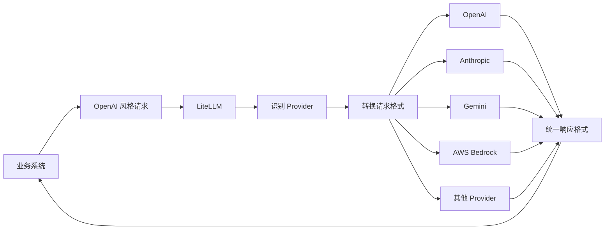

业务代码只需要理解一套统一格式，供应商差异由 LiteLLM 处理。

## 三、整体架构

LiteLLM 可以分为五层：

| 层次 | 主要职责 | 关键位置 |
| --- | --- | --- |
| 接入层 | Python API、HTTP API、Dashboard | `litellm/__init__.py`、`litellm/proxy`、`ui/litellm-dashboard` |
| 请求处理层 | 认证、权限、预算、限流、Hooks | `litellm/proxy/common_request_processing.py` |
| 调度层 | Deployment 选择、重试、回退、负载均衡 | `litellm/router.py` |
| Provider 适配层 | 请求转换、响应转换、供应商调用 | `litellm/llms` |
| 基础设施层 | 缓存、数据库、费用、日志和监控 | `litellm/caching`、`litellm/proxy/hooks`、`litellm/integrations` |

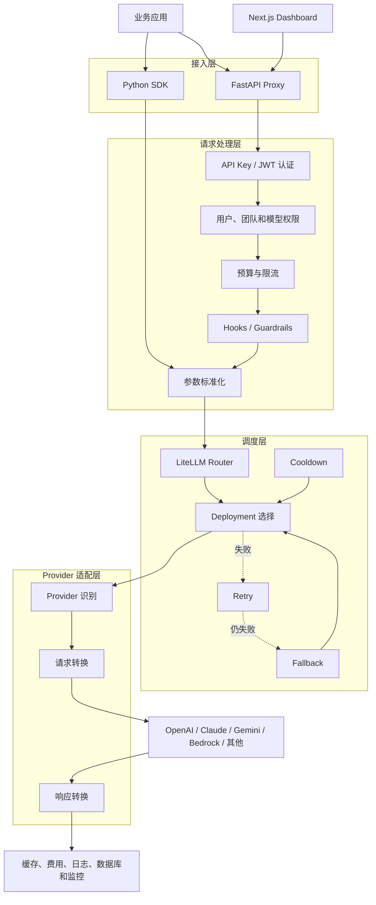

## 四、Python SDK 调用流程

主要入口位于 `litellm/__init__.py` 和 `litellm/main.py`。常见入口包括：

- `completion()`：同步文本生成
- `acompletion()`：异步文本生成
- `image_generation()`：同步图片生成
- `aimage_generation()`：异步图片生成

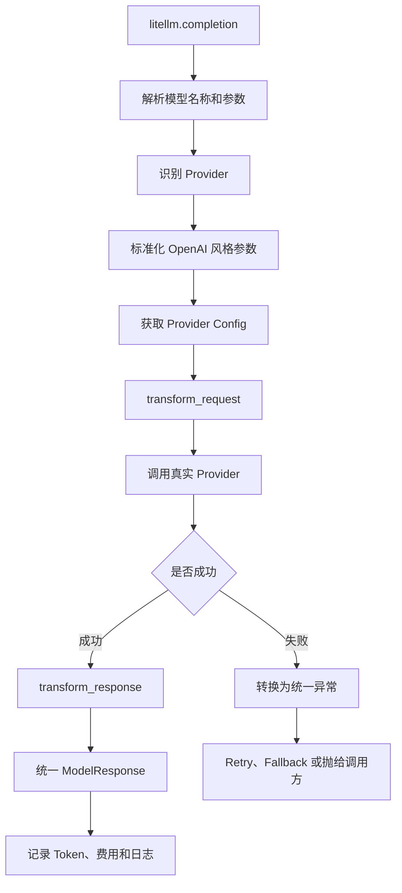

## 五、Proxy 请求流程

Proxy 基于 FastAPI，核心位置包括：

- `litellm/proxy/proxy_server.py`：HTTP 路由
- `litellm/proxy/auth/user_api_key_auth.py`：认证与身份上下文
- `litellm/proxy/common_request_processing.py`：公共请求处理
- `litellm/proxy/route_llm_request.py`：请求分发

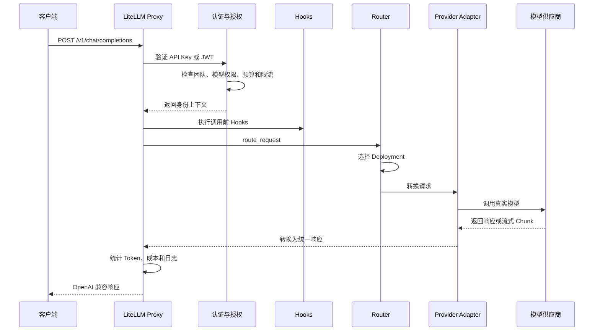

## 六、Router、Model Group 和 Deployment

**Model Group** 是客户端使用的逻辑模型名，例如 `customer-service-model`。

**Deployment** 是具体上游配置，通常包含 Provider、真实模型、API 地址、密钥、限流、权重和超时等信息。

```text
customer-service-model
├── OpenAI Deployment
├── Azure Deployment A
├── Azure Deployment B
└── Anthropic Deployment
```

Router 根据可用性、限流、冷却状态和路由策略选择 Deployment。临时错误可以 Retry；当前部署不可用时可以换 Deployment；模型组整体失败后可以进入 Fallback。

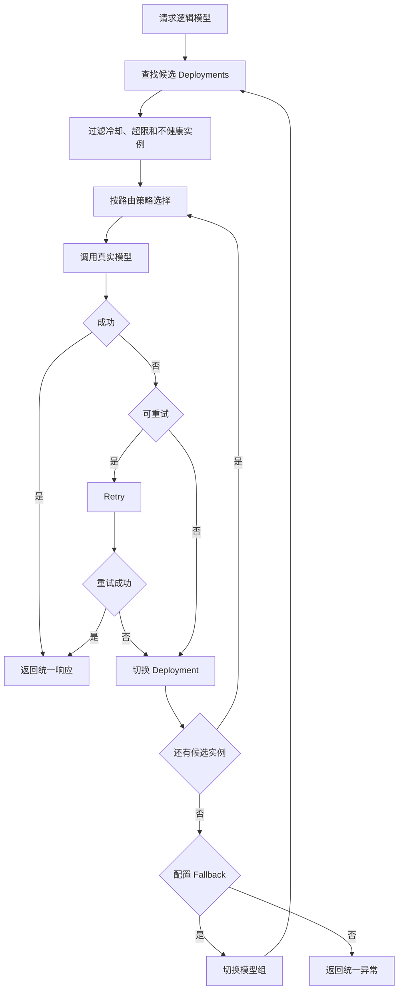

## 七、图片生成多上游

LiteLLM Router 提供 `Router.image_generation()` 和 `Router.aimage_generation()`，因此可以为一个逻辑图片模型配置多个 Deployment。

```text
marketing-image-model
├── OpenAI 图片模型
├── Azure 图片部署
├── Vertex AI Imagen
└── 其他图片 Provider
```

Router 的常规行为是**调用前选择一个上游**，如果失败再 Retry、切换 Deployment 或进入 Fallback。

它默认不是同时调用所有上游、生成多张图片后再挑选最好的一张。后者需要额外实现并行调用、图片评分和结果排序。

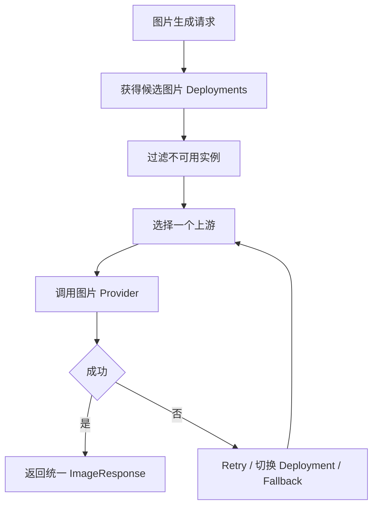

跨 Provider 回退时需要关注图片尺寸、宽高比、透明背景、图片编辑、参考图、返回 URL/Base64 和计费方式等能力差异。

> **我的应用设想**
>
> 图片生成模型在实际调用中可能出现超时、限流或服务错误，因此我计划为生图功能配置多个上游。正常请求可以通过轮询等策略分散到不同 Deployment；当选中的上游调用失败时，再结合 Retry、健康状态过滤和 Fallback 切换到其他可用上游。
>
> 这种设计不能保证生图服务永远不会失败，但可以减少单一上游故障带来的影响，提高整体可用性。为了避免不同模型能力不一致，我还需要确保同一模型组中的上游支持相近的图片参数。

### 视频生成是否可以采用相同思路

视频模型也可以采用多上游和故障回退思路。本地版本的 Router 会初始化 `video_generation()`、`avideo_generation()`、视频状态查询和视频内容获取等端点，并让视频生成进入通用的 fallback 调用流程。

> **我的进一步设想**
>
> 同理，我认为视频生成功能也适合配置多个上游。可以先从可用 Deployment 中选择一个视频模型；如果请求在任务创建阶段明确失败，再尝试其他上游，降低单一视频服务故障造成的影响。
>
> 不过视频生成通常是耗时较长的异步任务，不能简单地在每一次状态查询时轮询不同上游。某个上游成功接收任务后，后续状态查询和视频下载应继续访问创建该任务的 Provider 和 Deployment。否则可能找不到任务，或者重复创建视频并产生额外费用。因此，视频多上游主要用于**任务创建前的选择和创建失败后的回退**，任务创建成功后则需要保持上游绑定。

## 八、项目中的设计模式

### 1. 适配器模式

适配器模式负责把统一请求转换为供应商格式，再把供应商响应转换为统一响应。

```text
OpenAI 风格请求
      ↓
Provider Adapter
      ↓
Anthropic / Gemini / Bedrock 格式
      ↓
统一 ModelResponse
```

### 2. 策略模式

策略模式解决“多个 Deployment 中选择哪个”的问题。随机、轮询、权重、延迟或使用量等选择算法与 Provider 调用逻辑分离。

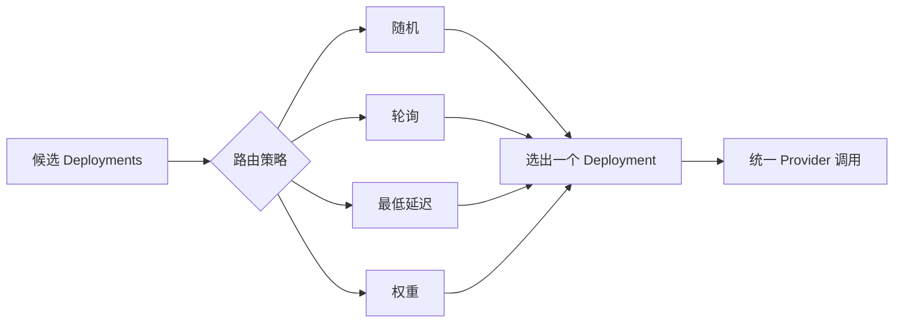

具体策略名称和端点支持情况应以当前版本配置为准。

### 3. 工厂模式

工厂模式解决“知道 Provider 和调用类型后，应该获取哪个处理器”的问题。

项目中的 `ProviderConfigManager` 可以按照 Provider 和 API 类型获取 Chat、Embedding、Image Generation、Audio、Video 等配置处理器，避免主函数堆积大量 `if/elif`。

```text
模型名称
   ↓
识别 Provider
   ↓
ProviderConfigManager
   ↓
获取对应 Provider Config
   ↓
转换并调用
```

> **我的理解修正**
>
> 我最初觉得工厂模式是面向切面编程的体现，但进一步区分后发现，它们解决的是两个不同的问题。工厂模式负责“根据 Provider 和调用类型获得哪个对象或处理器”；AOP 则负责“在模型调用前后统一执行哪些公共逻辑”，例如鉴权、日志、预算和费用统计。
>
> LiteLLM 中的 `ProviderConfigManager` 更接近 Provider 配置工厂；`Router.factory_function()` 则会根据 API 调用类型创建同步或异步包装函数，并让部分调用进入通用 fallback 流程。函数名称中虽然包含 `factory`，但它本身并不等于 AOP。真正体现 AOP 风格的是 Hooks、回调、依赖注入和调用前后处理。工厂与 AOP 可以在同一条请求链中配合使用，但不能把两者当成同一种设计模式。

### 4. AOP 风格 Hooks

认证、日志、预算、费用、Guardrails 和可观测性会横跨多个模型接口，属于横切关注点。

LiteLLM 通过 Hooks、回调、FastAPI 依赖注入、装饰器和通用请求处理器实现 AOP 风格设计。它不一定是传统的完整 AOP 框架。

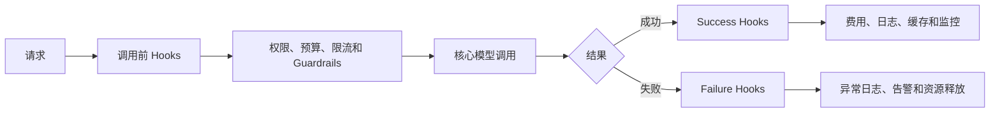

## 九、多租户

多租户表示多个用户、团队或组织共享同一个 LiteLLM Proxy，同时保持权限、预算和使用记录的逻辑隔离。

不同团队可以拥有不同的：

- Virtual API Key
- 可访问模型
- 请求限流
- 月度预算
- 消费记录
- 日志和 Guardrails

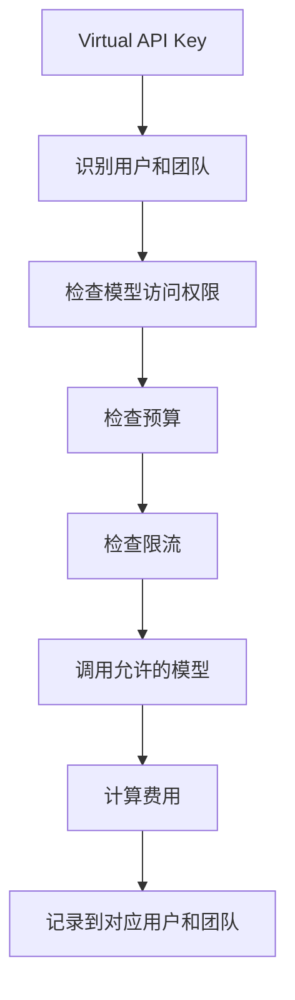

可以简化理解为：

```text
Organization
    ↓
Team
    ↓
User
    ↓
Virtual API Key
    ↓
End User
```

这种隔离通常首先是应用层逻辑隔离，不一定表示每个租户都有独立服务器或数据库。

## 十、Dashboard

Dashboard 位于 `ui/litellm-dashboard`，使用 Next.js 和 React。聊天调用的重要文件之一是：

```text
ui/litellm-dashboard/src/components/llm_calls/chat_completion.tsx
```

其中 `makeOpenAIChatCompletionRequest()` 创建 OpenAI JavaScript 客户端，并把 `baseURL` 指向 LiteLLM Proxy。这说明 Dashboard 也是 Proxy 的客户端。

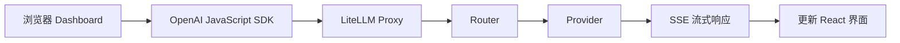

## 十一、关键源码阅读地图

| 阅读目标 | 文件或目录 | 重点内容 |
| --- | --- | --- |
| 项目定位 | `README.md` | SDK、Proxy 和功能说明 |
| 版本与依赖 | `pyproject.toml` | Python 版本和依赖 |
| 公共 Python API | `litellm/__init__.py` | 顶层 API 导出 |
| SDK 主流程 | `litellm/main.py` | `completion()`、`acompletion()` |
| Provider 适配 | `litellm/llms` | 请求与响应转换 |
| Provider Config | `litellm/utils.py` | `ProviderConfigManager` |
| Proxy 路由 | `litellm/proxy/proxy_server.py` | FastAPI 接口 |
| 公共请求流程 | `litellm/proxy/common_request_processing.py` | 请求前后处理 |
| 请求分发 | `litellm/proxy/route_llm_request.py` | `route_request()` |
| Router | `litellm/router.py` | Deployment、Retry、Fallback |
| 认证 | `litellm/proxy/auth/user_api_key_auth.py` | API Key 和 JWT |
| Hooks | `litellm/proxy/utils.py` | 调用前后 Hooks |
| 成本跟踪 | `litellm/proxy/hooks/proxy_track_cost_callback.py` | 费用和预算记录 |
| Dashboard | `ui/litellm-dashboard` | Next.js 管理界面 |
| 部署 | `docker-compose.yml` | 容器编排 |
| 测试 | `tests` | Router、Provider 和 Proxy 测试 |

行号会随版本变化，阅读时应优先搜索函数名和类名。

## 十二、推荐学习顺序

1. 阅读 `README.md`、`pyproject.toml` 和 `docker-compose.yml`，建立项目边界。
2. 从 `litellm/__init__.py` 进入 `litellm/main.py`，跟踪 `completion()`。
3. 选择一个 `litellm/llms` 下的 Provider，观察请求和响应转换。
4. 从 `proxy_server.py` 的 `chat_completion()` 跟踪 Proxy 请求。
5. 阅读认证、公共请求处理和 `route_request()`。
6. 跟踪 `Router.acompletion()`、Deployment 选择、Retry 和 Fallback。
7. 最后学习预算、限流、缓存、Hooks、成本、日志和 Dashboard。

第一次阅读只跟踪 `model`、`messages`、`provider`、`optional_params` 和 `ModelResponse`，不要试图一次理解所有参数。

## 十三、可以学到什么

- **统一接口设计**：为多个外部服务设计稳定接口。
- **高可用设计**：Retry、Fallback、Cooldown、健康检查和负载均衡。
- **异步与流式处理**：`async/await`、异步 HTTP、SSE 和流式 Chunk。
- **API Gateway**：认证、授权、预算、限流、审计和多租户。
- **配置驱动设计**：通过配置增加 Deployment，减少业务代码修改。
- **大型项目阅读方法**：从入口沿主调用链阅读，而不是逐文件阅读。
- **测试思路**：Provider Mock、路由故障、Fallback、预算和权限边界测试。

## 十四、推荐实践

创建逻辑模型 `my-chat-model`，配置主、备用两个 Deployment，然后验证：

1. 正常请求命中主 Deployment。
2. 主 Deployment 超时后触发 Retry。
3. 主 Deployment 不可用后切换备用 Deployment。
4. 客户端始终使用同一个逻辑模型名。
5. 记录最终 Provider、Token 和费用。
6. 测试流式和非流式响应。
7. 为测试 Key 设置小预算并验证超限行为。
8. 使用两个 Key 验证不同模型访问权限。

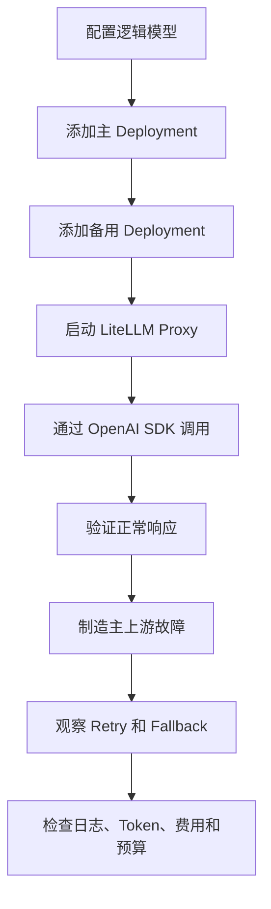

## 十五、总结

LiteLLM 的完整请求链可以概括为：

```text
统一接入
  → 身份认证
  → 权限、预算和限流
  → 参数标准化
  → Router 选择 Deployment
  → Provider 请求转换
  → 调用真实模型
  → 响应格式统一
  → 费用、日志和监控
```

最值得关注的三个模块是：

- `litellm/main.py`：统一不同 Provider 的 SDK 调用。
- `litellm/router.py`：处理 Deployment 选择、Retry、Fallback 和 Cooldown。
- `litellm/proxy`：把模型能力变成可供多个团队统一使用和治理的 AI Gateway。

对于初学者，最有效的阅读方法是从一次 `/v1/chat/completions` 请求出发，沿着下面的路径追踪：

```text
chat_completion()
      ↓
user_api_key_auth()
      ↓
base_process_llm_request()
      ↓
route_request()
      ↓
Router.acompletion()
      ↓
Provider Adapter
      ↓
真实模型服务
```

先理解这条主调用链，再学习缓存、Guardrails、费用、Dashboard 和可观测性，会更容易建立完整认识。
