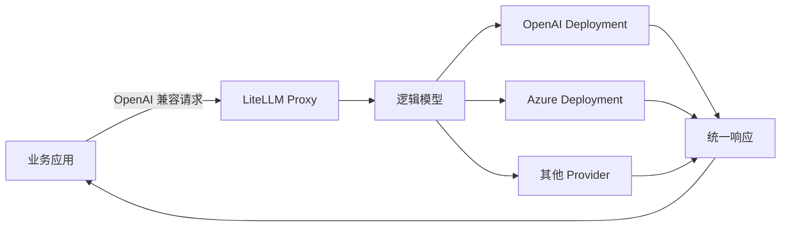

LiteLLM 把不同模型供应商的接口差异收进一个统一层。应用只需要发送接近 OpenAI API 的请求，就可以连接 OpenAI、Anthropic、Gemini、Azure OpenAI、AWS Bedrock 等上游。

这篇是三阶段学习路径的入口。读完后，你应该能回答三个问题：

1. LiteLLM 解决什么问题？
2. Python SDK 和 AI Gateway 应该选哪个？
3. 一次聊天请求在 LiteLLM 中经过哪些环节？

## 学习路径

| 阶段 | 目标 | 建议用时 |
| --- | --- | --- |
| **1. 入门导读（本文）** | 建立统一网关、逻辑模型和上游部署的基本认识 | 10 分钟 |
| [2. 架构深读](./litellm-architecture-deep-dive.md) | 沿源码调用链理解 Proxy、Router 与 Provider Adapter | 30 分钟 |
| [3. 动手实验](./litellm-hands-on-lab.md) | 启动本地 Proxy，完成正常调用与故障验证 | 30–45 分钟 |

如果你只想先看到结果，可以直接进入[动手实验](./litellm-hands-on-lab.md)，再回来补架构。

## 1. LiteLLM 是什么

LiteLLM 同时提供两种形态：

- **Python SDK**：在 Python 进程内统一调用不同模型。
- **AI Gateway（Proxy）**：作为独立 HTTP 服务，为多个应用提供统一入口和集中治理。

### Python SDK：适合单个应用

```python
import litellm

response = litellm.completion(
    model="openai/your-model-name",
    messages=[{"role": "user", "content": "请用一句话解释 LiteLLM"}],
)

print(response.choices[0].message.content)
```

异步应用可以使用 `litellm.acompletion()`。如果只有一个 Python 应用、少量模型，而且不需要统一 Key、预算或团队权限，SDK 通常更直接。

### AI Gateway：适合共享模型能力

业务应用统一请求 `/v1/chat/completions` 等 OpenAI 兼容接口。Proxy 再根据配置选择真实供应商，并在请求前后执行认证、路由、日志和费用统计。



当多个应用需要共享模型、密钥、预算、限流、重试或故障切换时，Gateway 的价值更明显。

## 2. 它解决的核心问题

直接接入多个供应商时，业务代码必须处理不同的：

- API 地址和鉴权方式
- 模型名与请求参数
- 响应和流式协议
- 异常类型与重试规则
- Token 统计与计费字段

LiteLLM 提供稳定的客户端接口，把供应商差异放进 Provider Adapter。这样更换上游时，业务代码仍然使用相同的 `model`、`messages` 和响应结构。

它不负责替你选择业务提示词，也不能消除供应商之间的能力差异。统一接口表示“调用方式尽量一致”，不表示所有模型支持完全相同的参数和效果。

## 3. 先记住四个概念

### Provider

真实模型供应商，例如 OpenAI、Anthropic 或 Azure OpenAI。

### Deployment

一份可以实际调用的上游配置，通常包含真实模型名、API 地址、密钥、超时和限流信息。

### Model Group

客户端看到的逻辑模型名。例如客户端始终请求 `customer-service-model`，它背后可以对应多个 Deployment。

```text
customer-service-model
├── OpenAI Deployment
├── Azure Deployment A
└── Azure Deployment B
```

### Router

从候选 Deployment 中选择一个上游，并处理重试、冷却和回退。客户端不需要知道最终命中了哪个供应商。

> **容易混淆的地方**
>
> 重试通常是“再次尝试当前调用”；切换 Deployment 是“换同一逻辑模型下的另一个实例”；Fallback 是“当前模型组不可用后切换到另一个模型组”。具体行为取决于配置和错误类型。

## 4. 一次请求发生了什么

以 Proxy 的聊天接口为例：

```text
POST /v1/chat/completions
  → 验证调用方 Key
  → 检查模型权限、预算与限流
  → 标准化 OpenAI 风格参数
  → Router 选择 Deployment
  → Provider Adapter 转换请求
  → 调用真实模型
  → 转换为统一响应
  → 记录 Token、费用、日志与监控数据
```

这条链路解释了 LiteLLM 为什么不仅是“改一下 API 地址”：它既负责协议适配，也可以承担网关治理和高可用调度。

## 5. 该用 SDK 还是 Gateway

| 场景                               | 更合适的选择 | 原因                 |
| ---------------------------------- | ------------ | -------------------- |
| 一个 Python 应用试用多个模型       | Python SDK   | 依赖少，调用路径短   |
| 非 Python 应用需要 OpenAI 兼容接口 | Gateway      | 通过 HTTP 与语言解耦 |
| 多个应用共享供应商密钥             | Gateway      | 密钥留在统一服务端   |
| 需要团队权限、预算、限流和审计     | Gateway      | 治理能力集中实现     |
| 只调用一家供应商且没有治理需求     | 官方 SDK     | 最小复杂度通常更重要 |

不要因为“以后可能需要”就立即引入完整网关。先确认是否真的存在多应用、多供应商或集中治理需求。

## 6. 能从项目中学到什么

LiteLLM 适合用来学习这些工程问题：

- **统一接口设计**：如何在多个外部服务之上建立稳定契约。
- **适配器模式**：如何双向转换请求、响应和异常。
- **高可用路由**：Retry、Fallback、Cooldown 与健康状态如何协作。
- **API Gateway**：认证、权限、预算、限流和审计如何进入同一请求链。
- **异步与流式处理**：异步 HTTP、SSE 与流式 Chunk 的传递方式。
- **配置驱动设计**：如何增加 Deployment 而不修改业务调用代码。

## 7. 推荐阅读方式

第一次读源码时，只跟踪以下数据：

- `model`
- `messages`
- `provider`
- `optional_params`
- `ModelResponse`

先找到它们在哪里被识别、转换和返回，不要试图一次理解所有参数、Provider 和回调。

## 下一步

继续阅读[第 2 阶段：LiteLLM 架构深读](./litellm-architecture-deep-dive.md)，沿一次 `/v1/chat/completions` 请求拆解 Proxy、Router 与 Provider Adapter。

如果你更偏向实践，也可以直接进入[第 3 阶段：LiteLLM 动手实验](./litellm-hands-on-lab.md)，用可复制配置启动本地网关。
