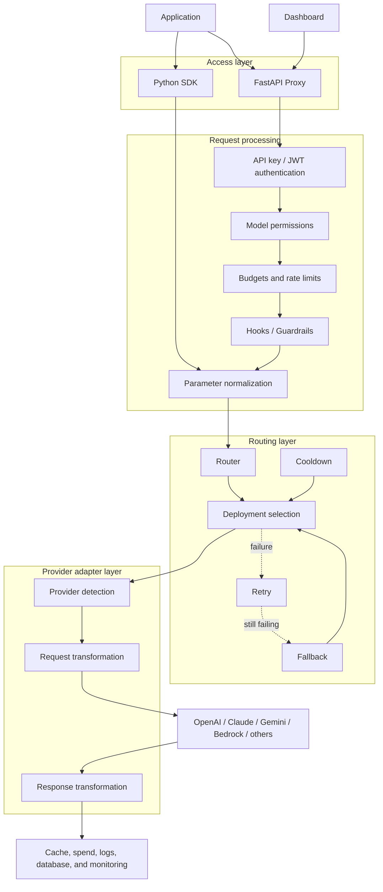
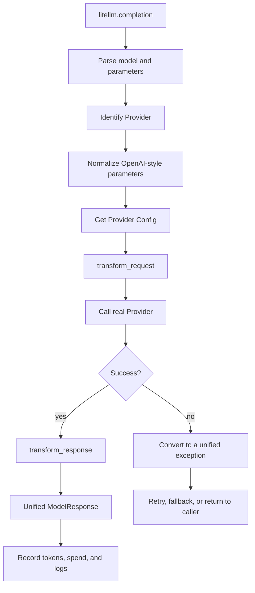
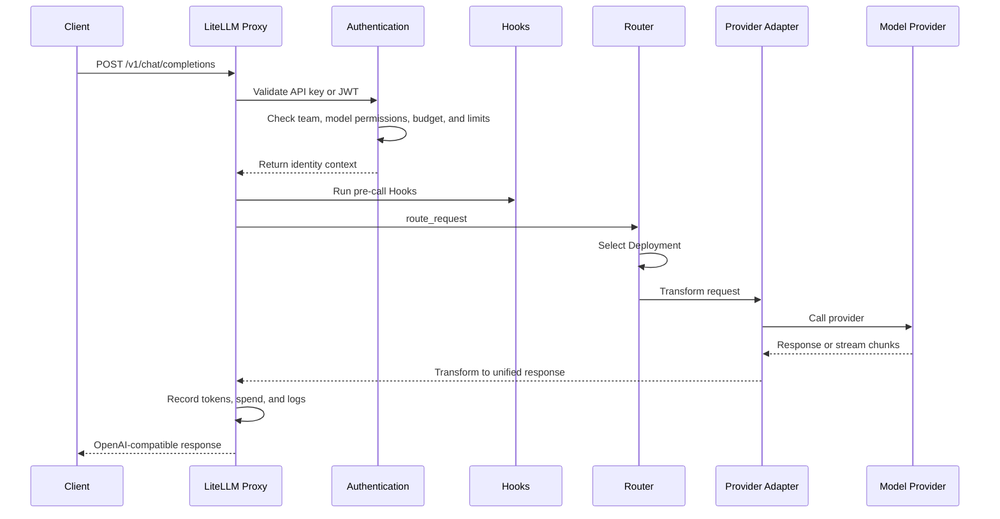
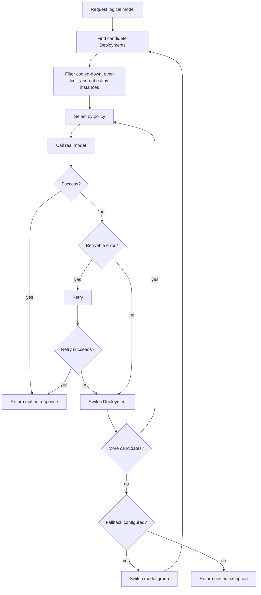
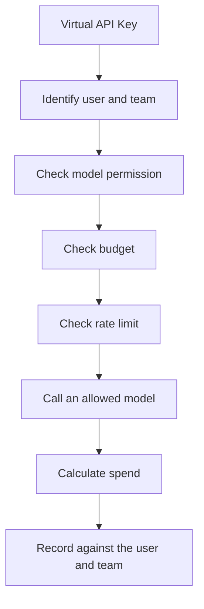
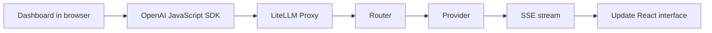

This is Stage 2 of the LiteLLM learning path. Read the [beginner guide](./litellm-project-guide.md) first, then use the [hands-on lab](./litellm-hands-on-lab.md) to turn routing and failure behavior into observable results.

This page focuses on stable architectural relationships. The directory and symbol map is based on the LiteLLM `1.100.0` source tree. Line numbers and implementation details can change, so search for class and function names when reading another version.

## 1. Five architectural layers

LiteLLM can be divided into five responsibility layers:

| Layer | Main responsibility | Important locations |
| --- | --- | --- |
| Access | Python API, HTTP API, and Dashboard | `litellm/__init__.py`, `litellm/proxy`, `ui/litellm-dashboard` |
| Request processing | Authentication, permissions, budgets, limits, and Hooks | `litellm/proxy/common_request_processing.py` |
| Routing | Deployment selection, retries, fallbacks, and load balancing | `litellm/router.py` |
| Provider adapters | Request transformation, provider calls, and response transformation | `litellm/llms` |
| Infrastructure | Cache, database, spend, logs, and monitoring | `litellm/caching`, `litellm/proxy/hooks`, `litellm/integrations` |



The important result of this split is responsibility isolation. The access layer does not implement every provider protocol, a Provider Adapter does not decide team budgets, and an application does not need to know the final Deployment.

## 2. Python SDK call path

Public SDK entry points are exported from `litellm/__init__.py`, with primary implementations in `litellm/main.py`. Common entry points include:

- `completion()` for synchronous text generation
- `acompletion()` for asynchronous text generation
- `image_generation()` and `aimage_generation()` for image generation



The SDK and Proxy paths reuse much of the parameter normalization, Provider detection, and response modeling. The Proxy also has to establish a remote caller's identity and enforce governance rules.

## 3. Proxy request path

The Proxy is built with FastAPI. Start with these locations for a chat request:

- `litellm/proxy/proxy_server.py` for HTTP routes
- `litellm/proxy/auth/user_api_key_auth.py` for authentication and identity context
- `litellm/proxy/common_request_processing.py` for shared request handling
- `litellm/proxy/route_llm_request.py` for request dispatch



A streaming call does not wait for all text before returning. It transforms upstream chunks into OpenAI-compatible SSE data and forwards them to the client. Errors need separate handling before response headers are sent and during the stream.

## 4. Model Groups, Deployments, and the Router

### A Model Group is a client contract

The client uses a logical model name such as `customer-service-model`. That name can express a business capability instead of hard-coding a vendor in application code.

### A Deployment is an executable upstream

A Deployment describes a real call target and may contain:

- Provider and real model name
- API address and credential reference
- Timeout, rate limit, and weight
- Region, account, or API version

```text
customer-service-model
├── OpenAI Deployment
├── Azure Deployment A
├── Azure Deployment B
└── Anthropic Deployment
```

### The Router selects and recovers

The Router chooses a Deployment according to candidate availability, routing policy, rate limits, and cooldown state.



This does not mean retrying every failure. Authentication errors, invalid parameters, rate limits, and network timeouts require different treatment. Error classification and configuration together determine whether LiteLLM retries or falls back.

## 5. How Provider Adapters normalize differences

A Provider Adapter performs transformations in both directions:

```text
OpenAI-style request
      ↓
Provider Config / Adapter
      ↓
Anthropic / Gemini / Bedrock request
      ↓
Provider response or error
      ↓
Unified ModelResponse / unified exception
```

Typical responsibilities include:

1. Determine whether a common parameter is supported by this Provider.
2. Transform `messages`, tool calls, images, and streaming options.
3. Send synchronous or asynchronous HTTP requests.
4. Convert the response, token usage, and finish reason to common models.
5. Map provider errors to exception types the upper layers can handle.

A normalization layer must still preserve capability boundaries. Renaming a parameter cannot make a Provider support a feature it does not implement; callers should test the model capabilities they depend on.

## 6. Important design patterns

### Adapter pattern

Provider-specific transformations stay in separate adapters instead of becoming a long set of vendor branches in the business entry point.

### Strategy pattern

Deployment selection is separate from provider calls. Random, round-robin, weighted, latency-aware, or usage-aware decisions can be routing inputs. Check the current release for exact policy names.

### Factory pattern

`ProviderConfigManager` obtains handlers for Chat, Embedding, Image, Audio, Video, and other API types according to Provider and operation.

A factory answers “which handler should be returned?” It is not the same as AOP. Although `Router.factory_function()` contains `factory` in its name, it primarily creates synchronous or asynchronous wrappers by API type and lets supported operations enter common fallback handling.

### AOP-style Hooks

Authentication, logging, budgets, spend, Guardrails, and observability cross several model interfaces. LiteLLM places these concerns around model calls through Hooks, callbacks, FastAPI dependency injection, decorators, and shared request processors.

```mermaid
flowchart LR
    A["Request"] --> B["Pre-call Hooks"]
    B --> C["Permissions, budget, limits, and Guardrails"]
    C --> D["Core model call"]
    D --> E{"Result"]
    E -- success --> F["Success Hooks"] --> G["Spend, logs, cache, and monitoring"]
    E -- failure --> H["Failure Hooks"] --> I["Error logs, alerts, and cleanup"]
```

It is more precise to call this an AOP-style Hook and callback design than a complete traditional AOP framework.

## 7. Multi-tenant governance

Several users, teams, or organizations can share one Proxy while permissions, budgets, and usage records remain logically separated.

```text
Organization
    ↓
Team
    ↓
User
    ↓
Virtual API Key
    ↓
End User
```

Different teams can have different:

- Virtual API Keys
- Allowed models
- Request limits
- Monthly budgets
- Spend records
- Logs and Guardrails



This is application-level logical isolation first. It does not automatically provide a separate server or database for every tenant. Stronger isolation requirements may need separate instances, databases, networks, or cloud accounts.

## 8. The Dashboard is also a Proxy client

The Dashboard lives under `ui/litellm-dashboard` and uses Next.js and React. Chat-related code creates an OpenAI JavaScript client and points its `baseURL` to the LiteLLM Proxy.



The Dashboard therefore does not bypass gateway governance. Like other clients, it accesses model capability through the Proxy.

## 9. Boundaries for image and video upstreams

A Router can put several Deployments behind one logical image model. Normal behavior is to **select one upstream before the call**, then Retry, switch Deployment, or Fallback after failure. It does not normally generate through every upstream and automatically rank the images.

Cross-provider fallback must account for differences in image size, aspect ratio, transparent backgrounds, image editing, reference images, URL/Base64 output, and pricing.

Video generation adds task ownership:

- An upstream can be selected before task creation.
- Another upstream can be tried if creation clearly fails.
- After an upstream accepts the task, status checks and downloads must remain bound to that Provider and Deployment.

Otherwise the task may not be found, or a retry may create a duplicate video and extra cost.

## 10. Source-reading map

| Goal | File or directory | What to inspect |
| --- | --- | --- |
| Project scope | `README.md` | SDK, Proxy, and capability boundaries |
| Version and dependencies | `pyproject.toml` | Python versions and dependencies |
| Public Python API | `litellm/__init__.py` | Top-level exports |
| SDK flow | `litellm/main.py` | `completion()` and `acompletion()` |
| Provider adapters | `litellm/llms` | Request, response, and error transformations |
| Provider configuration | `litellm/utils.py` | `ProviderConfigManager` |
| Proxy routes | `litellm/proxy/proxy_server.py` | FastAPI endpoints |
| Shared request flow | `litellm/proxy/common_request_processing.py` | Before/after request processing |
| Request dispatch | `litellm/proxy/route_llm_request.py` | `route_request()` |
| Router | `litellm/router.py` | Deployment, Retry, and Fallback |
| Authentication | `litellm/proxy/auth/user_api_key_auth.py` | API keys and JWT |
| Spend tracking | `litellm/proxy/hooks/proxy_track_cost_callback.py` | Spend and budgets |
| Dashboard | `ui/litellm-dashboard` | How the UI calls the Proxy |
| Deployment | `docker-compose.yml` | Container orchestration |
| Tests | `tests` | Router, Provider, and Proxy tests |

## 11. A reading order that stays focused

1. Read `README.md`, `pyproject.toml`, and `docker-compose.yml` to establish the project boundary.
2. Enter `litellm/main.py` from `litellm/__init__.py` and follow `completion()`.
3. Pick one Provider under `litellm/llms` and inspect request and response transformations.
4. Follow a Proxy request from `chat_completion()` in `proxy_server.py`.
5. Read authentication, shared request processing, and `route_request()`.
6. Follow `Router.acompletion()`, Deployment selection, Retry, and Fallback.
7. Study budgets, rate limits, caching, Hooks, spend, logs, and the Dashboard last.

At every step, record the input data, responsible module, output data, and failure path. This builds a more stable mental model than reading every directory in sequence.

## Next step

Open [Stage 3: LiteLLM hands-on lab](./litellm-hands-on-lab.md) to start a local Proxy and verify that:

- A valid key can access a logical model.
- An invalid key is rejected before an upstream call.
- An unknown model is not silently forwarded.
- An unreachable upstream becomes an observable gateway error.

You can also return to [Stage 1: LiteLLM beginner guide](./litellm-project-guide.md) to review the core concepts.
