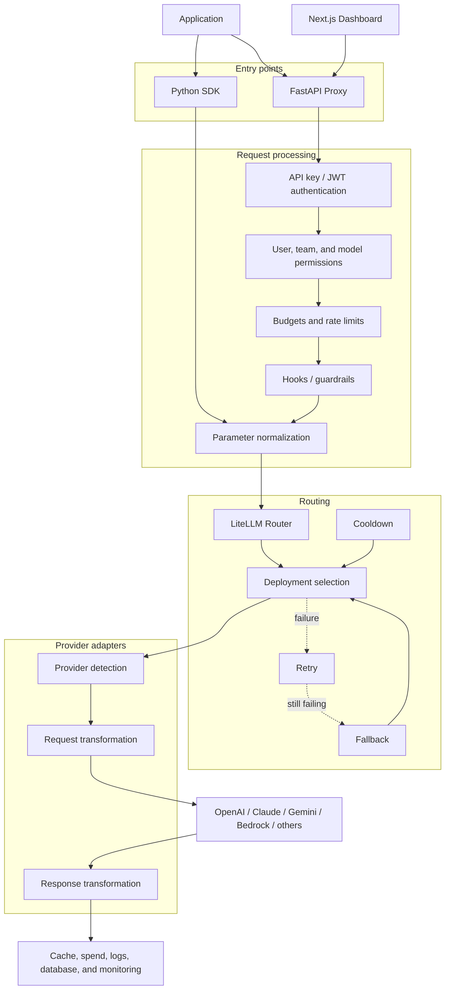
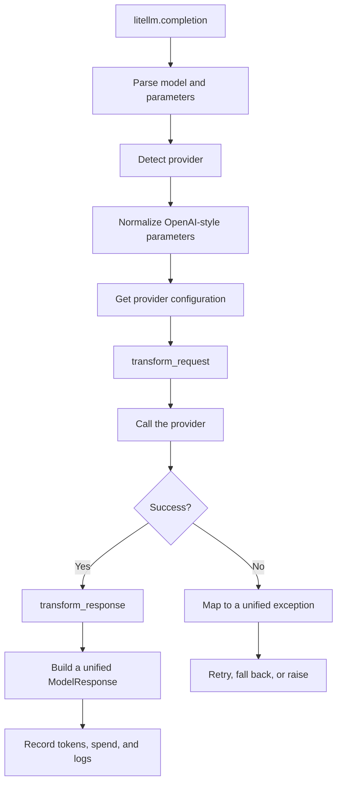
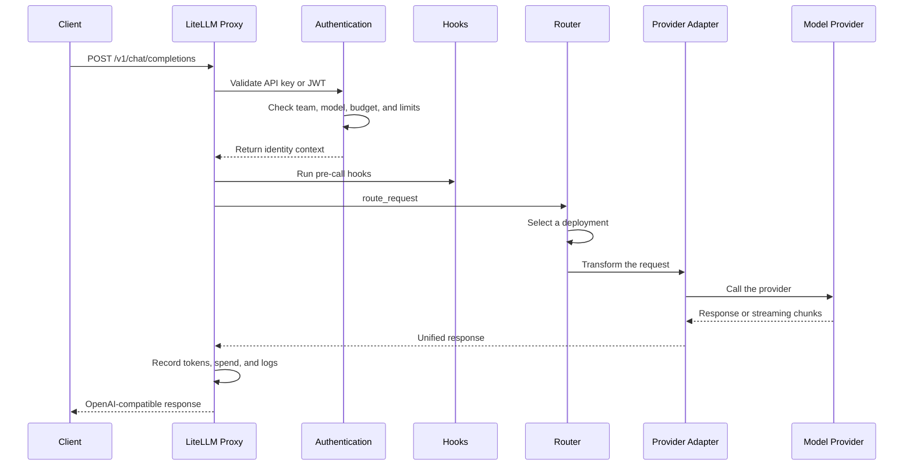
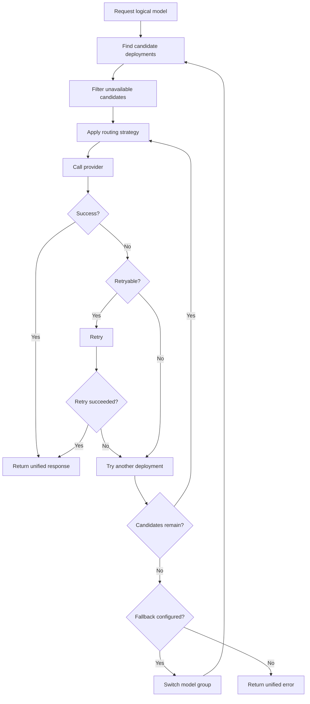
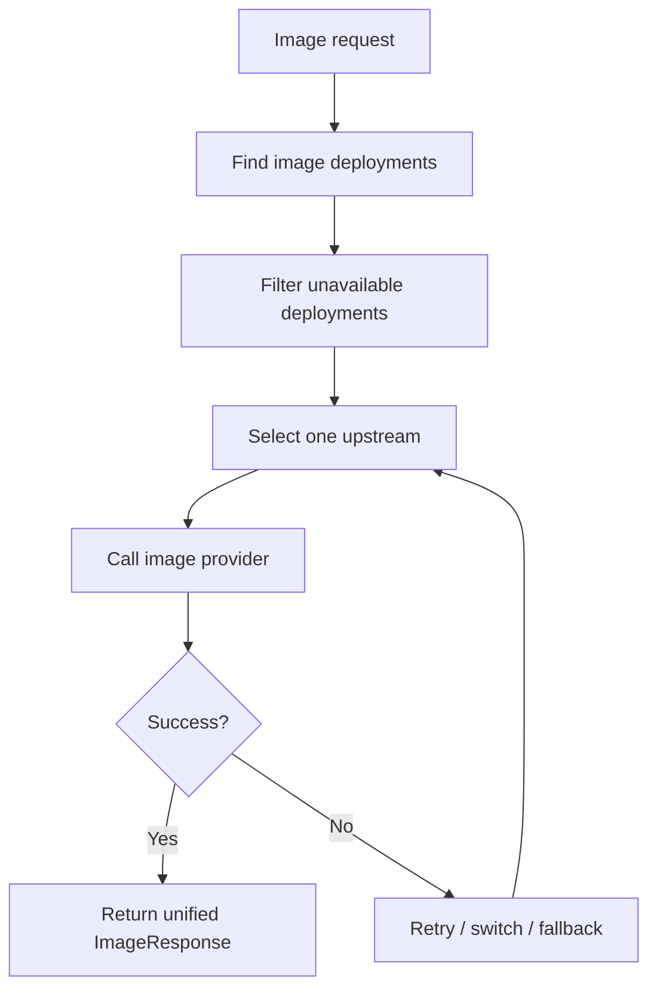
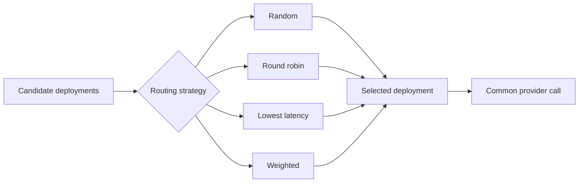
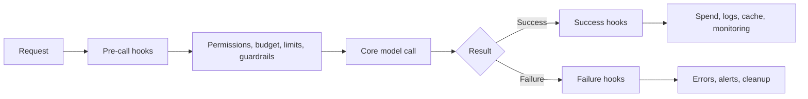
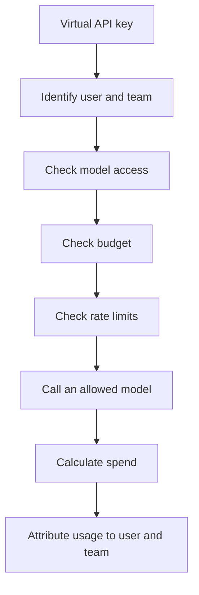
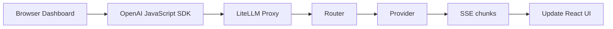
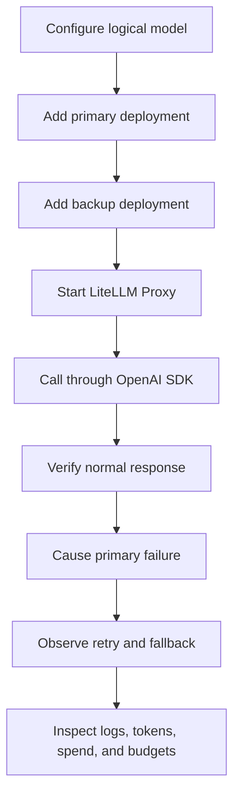

## Overview

LiteLLM is an open-source Python SDK and AI gateway. It presents OpenAI-compatible interfaces for providers such as OpenAI, Anthropic Claude, Google Gemini, AWS Bedrock, and Azure OpenAI.

Beyond API normalization, LiteLLM includes model routing, load balancing, retries, fallbacks, virtual API keys, budgets, rate limits, logging, spend tracking, guardrails, and an administrative dashboard.

This guide is based on a local review of LiteLLM version **`1.100.0`**, which requires Python **`>=3.10,<3.15`**. It is intended for developers learning LiteLLM, FastAPI, asynchronous Python, AI gateway architecture, or design patterns in a large open-source project.

## 1. Two ways to use LiteLLM

### Python SDK

A Python application can call LiteLLM directly:

```python
import litellm

response = litellm.completion(
    model="openai/your-model-name",
    messages=[{"role": "user", "content": "Explain LiteLLM"}],
)

print(response)
```

Asynchronous applications can use `litellm.acompletion()`. This approach works well when one Python application needs a consistent interface for several models without centralized team governance.

### AI gateway

LiteLLM can also run as an independent proxy. Applications send OpenAI-compatible requests such as `POST /v1/chat/completions`, and the proxy chooses and calls the actual provider.

A gateway becomes useful when you need to:

- Share model access across several applications.
- Manage provider credentials centrally.
- Enforce user, team, model, and budget policies.
- Apply rate limits, load balancing, and failover.
- Centralize logs, spend tracking, and observability.

> **My assessment**
>
> A small project with one application and one model may not need the complete LiteLLM Proxy. Calling LiteLLM as a library, or using the provider's official SDK, can be simpler.
>
> The proxy becomes much more valuable when several applications share models or providers. It prevents each application from independently implementing credential storage, model configuration, permissions, budgets, and request logging.

## 2. The problem LiteLLM solves

Providers use different endpoints, SDKs, authentication methods, parameters, response formats, streaming protocols, exceptions, token accounting, and prices. Direct multi-provider integrations therefore accumulate provider-specific branches throughout application code.

LiteLLM inserts a normalization layer:


The application understands one stable contract while LiteLLM handles provider differences.

## 3. Architecture

LiteLLM can be understood as five layers:

| Layer | Responsibility | Important locations |
| --- | --- | --- |
| Entry points | Python API, HTTP API, and Dashboard | `litellm/__init__.py`, `litellm/proxy`, `ui/litellm-dashboard` |
| Request processing | Authentication, permissions, budgets, limits, and hooks | `litellm/proxy/common_request_processing.py` |
| Routing | Deployment selection, retries, fallbacks, and load balancing | `litellm/router.py` |
| Provider adapters | Request transformation, provider invocation, and response transformation | `litellm/llms` |
| Infrastructure | Caching, persistence, spend tracking, logging, and observability | `litellm/caching`, `litellm/proxy/hooks`, `litellm/integrations` |



## 4. Python SDK request flow

The public entry points are exposed from `litellm/__init__.py`, while the main SDK flow lives in `litellm/main.py`. Common operations include:

- `completion()` for synchronous text generation.
- `acompletion()` for asynchronous text generation.
- `image_generation()` for synchronous image generation.
- `aimage_generation()` for asynchronous image generation.



The provider adapter layer is central: each adapter translates a common request into provider-specific data and translates the result back into LiteLLM's common response model.

## 5. Proxy request flow

The FastAPI proxy is primarily implemented in these locations:

- `litellm/proxy/proxy_server.py` for HTTP routes.
- `litellm/proxy/auth/user_api_key_auth.py` for authentication and request identity.
- `litellm/proxy/common_request_processing.py` for shared request handling.
- `litellm/proxy/route_llm_request.py` for dispatch.



Streaming requests return chunks through Server-Sent Events instead of waiting for the complete generation.

## 6. Router, model groups, and deployments

A **model group** is the logical model name used by clients, such as `customer-service-model`.

A **deployment** is one concrete upstream configuration: provider, actual model name, endpoint, credential, rate limit, weight, timeout, and related settings.

```text
customer-service-model
├── OpenAI deployment
├── Azure deployment A
├── Azure deployment B
└── Anthropic deployment
```

The Router filters unavailable, rate-limited, unhealthy, or cooling-down deployments and then applies a routing strategy. A transient failure may be retried; another deployment can be selected when the current one is unavailable; a failed model group can move to a configured fallback group.



## 7. Multiple upstreams for image and video generation

LiteLLM Router exposes `Router.image_generation()` and `Router.aimage_generation()`, so a logical image model can have several deployments:

```text
marketing-image-model
├── OpenAI image deployment
├── Azure image deployment
├── Vertex AI Imagen deployment
└── Another image provider
```

The usual behavior is to select one upstream before the call. If it fails, LiteLLM can retry, switch deployments, or use a fallback. It does not normally call every provider and rank all generated images. That would require a separate orchestration layer for parallel generation, scoring, and ranking.



> **My intended use**
>
> Image services can encounter timeouts, rate limits, or provider errors, so I would configure several upstream deployments. A round-robin or similar policy can distribute normal requests, while retries, health filtering, and fallbacks reduce the effect of a single provider failure.
>
> This cannot guarantee that generation never fails. It improves overall availability, and deployments in the same group should support reasonably compatible image parameters.

Video generation can follow a similar strategy, but it is usually asynchronous and long-running. Multiple upstreams are most useful when choosing where to create a task or when task creation clearly fails. Once a provider accepts a task, status polling and content retrieval should remain bound to the provider and deployment that created it. Polling another provider could lose the task or create duplicate work and spend.

## 8. Design patterns

### Adapter pattern

The adapter pattern normalizes providers:

```text
OpenAI-style request
      ↓
Provider adapter
      ↓
Anthropic / Gemini / Bedrock request
      ↓
Unified ModelResponse
```

Adapters implement provider-specific request transformation, invocation, response transformation, streaming conversion, and exception mapping.

### Strategy pattern

The strategy pattern separates the deployment-selection algorithm from provider invocation. Conceptual strategies include random selection, round robin, weights, latency, or usage.



Exact strategy names and endpoint support depend on the LiteLLM version and configuration.

### Factory pattern

The factory pattern answers which object or handler should be obtained after the provider and operation type are known. `ProviderConfigManager` can return configuration handlers for chat, embeddings, image generation, audio, video, and other APIs instead of spreading large `if/elif` chains across the main flow.

```text
Model name
   ↓
Detect provider
   ↓
ProviderConfigManager
   ↓
Get matching Provider Config
   ↓
Transform and invoke
```

> **A corrected understanding**
>
> I initially thought that the factory pattern was an expression of aspect-oriented programming. They actually solve different problems. A factory obtains the right object for a provider and operation type. Aspect-oriented programming applies shared behavior around model calls, such as authentication, logs, budget checks, and spend tracking.
>
> `ProviderConfigManager` is close to a provider configuration factory. A method named `Router.factory_function()` can create synchronous or asynchronous wrapper functions, but the word `factory` does not make it AOP. Hooks, callbacks, dependency injection, and pre/post-call processing are the AOP-style mechanisms.

### AOP-style hooks

Authentication, logging, budgets, spend, guardrails, and observability cross many model APIs. LiteLLM centralizes them through hooks, callbacks, FastAPI dependencies, decorators, and common request handlers.



This is best described as AOP-style design rather than necessarily a traditional full AOP framework.

## 9. Multi-tenancy

Multi-tenancy means that users, teams, or organizations share one LiteLLM Proxy while permissions, budgets, and usage records remain logically separated.

Tenants can have different:

- Virtual API keys.
- Allowed models.
- Rate limits.
- Monthly budgets.
- Spend records.
- Logs and guardrails.



A simplified identity hierarchy is:

```text
Organization
    ↓
Team
    ↓
User
    ↓
Virtual API Key
    ↓
End User
```

This is usually application-level logical isolation. It does not automatically mean that every tenant receives a separate server or database.

## 10. Dashboard

The Next.js and React dashboard lives under `ui/litellm-dashboard`. One important client function is `makeOpenAIChatCompletionRequest()` in `ui/litellm-dashboard/src/components/llm_calls/chat_completion.tsx`.

The Dashboard configures an OpenAI JavaScript client to use the LiteLLM Proxy as its base URL, which means that the Dashboard is another gateway client:



This area is useful for learning Next.js, streaming UI updates, `AbortSignal`, token usage presentation, latency measurement, and frontend/backend separation.

## 11. Source reading map

| Goal | File or directory | Focus |
| --- | --- | --- |
| Project scope | `README.md` | SDK and proxy features |
| Version and dependencies | `pyproject.toml` | Python version and dependencies |
| Public Python API | `litellm/__init__.py` | Top-level exports |
| SDK flow | `litellm/main.py` | `completion()` and `acompletion()` |
| Provider adapters | `litellm/llms` | Request and response transformations |
| Provider configuration | `litellm/utils.py` | `ProviderConfigManager` |
| Proxy routes | `litellm/proxy/proxy_server.py` | FastAPI endpoints |
| Shared request processing | `litellm/proxy/common_request_processing.py` | Pre/post-call flow |
| Dispatch | `litellm/proxy/route_llm_request.py` | `route_request()` |
| Routing | `litellm/router.py` | Deployments, retries, and fallbacks |
| Authentication | `litellm/proxy/auth/user_api_key_auth.py` | API keys and JWTs |
| Hooks | `litellm/proxy/utils.py` | Pre/post-call hooks |
| Spend tracking | `litellm/proxy/hooks/proxy_track_cost_callback.py` | Spend and budget records |
| Dashboard | `ui/litellm-dashboard` | Next.js interface |
| Deployment | `docker-compose.yml` | Container orchestration |
| Tests | `tests` | Provider, Router, and Proxy tests |

Line numbers change as the project evolves, so search by class or function name rather than relying on fixed locations.

## 12. Recommended learning path

1. Read `README.md`, `pyproject.toml`, and `docker-compose.yml` to understand the project boundary.
2. Start at `litellm/__init__.py`, enter `litellm/main.py`, and follow `completion()`.
3. Choose one provider under `litellm/llms` and compare request and response transformations.
4. Follow `chat_completion()` from `proxy_server.py` through authentication and shared request processing.
5. Continue into `route_request()` and `Router.acompletion()`.
6. Study deployment selection, retries, fallbacks, and cooldowns.
7. Finish with budgets, rate limits, caching, hooks, spend, logs, and the Dashboard.

On the first pass, follow only `model`, `messages`, `provider`, `optional_params`, and `ModelResponse`. Trying to understand every option immediately makes the call chain harder to see.

## 13. What you can learn

- **Stable interface design:** normalize several external services without losing provider-specific capabilities.
- **Resilience:** retries, fallbacks, cooldowns, health filtering, and load balancing.
- **Asynchronous streaming:** `async/await`, asynchronous HTTP, generators, SSE, and streaming chunks.
- **Gateway governance:** authentication, authorization, budgets, rate limits, audit, and multi-tenancy.
- **Configuration-driven systems:** add deployments through configuration rather than application rewrites.
- **Large repository navigation:** follow one entry point and call chain instead of reading every file in directory order.
- **Testing:** mock providers and test routing failure, fallback, budget, and permission boundaries.

## 14. Suggested exercise

Create a logical model named `my-chat-model` with a primary and backup deployment. Verify:

1. A normal request reaches the intended primary deployment.
2. A timeout triggers the configured retry behavior.
3. An unavailable primary causes selection of the backup deployment.
4. Clients continue to use one logical model name.
5. The selected provider, tokens, and spend are recorded.
6. Both streaming and non-streaming requests work.
7. A small test budget rejects requests after the limit.
8. Two virtual keys receive different model permissions.



## 15. Summary

The complete LiteLLM flow can be summarized as:

```text
Unified entry point
  → Authentication
  → Permissions, budgets, and limits
  → Parameter normalization
  → Router selects a deployment
  → Provider request transformation
  → Actual model call
  → Unified response
  → Spend, logs, and monitoring
```

The three most important areas are:

- `litellm/main.py` for unified SDK calls.
- `litellm/router.py` for deployment selection, retries, fallbacks, and cooldowns.
- `litellm/proxy` for turning model access into a governed, multi-tenant AI gateway.

For a first source-code walkthrough, follow one `/v1/chat/completions` request through:

```text
chat_completion()
      ↓
user_api_key_auth()
      ↓
base_process_llm_request()
      ↓
route_request()
      ↓
Router.acompletion()
      ↓
Provider adapter
      ↓
Actual model service
```

Understanding this path first makes caching, guardrails, spend tracking, the Dashboard, and observability much easier to place.
