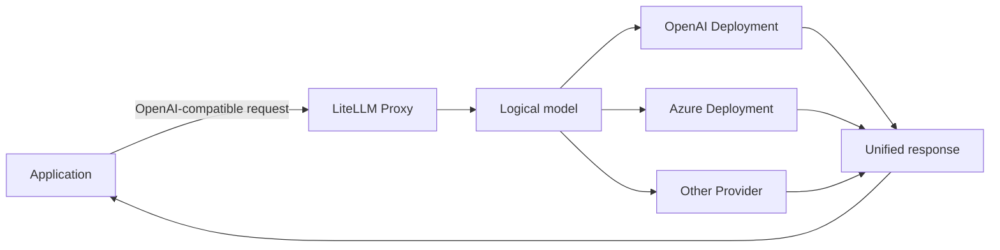

LiteLLM puts differences between model providers behind one unified layer. An application can send requests that resemble the OpenAI API while connecting to upstreams such as OpenAI, Anthropic, Gemini, Azure OpenAI, and AWS Bedrock.

This page is the entry point to a three-stage learning path. After reading it, you should be able to answer three questions:

1. What problem does LiteLLM solve?
2. When should you choose the Python SDK or the AI Gateway?
3. Which stages does a chat request pass through inside LiteLLM?

## Learning path

| Stage | Goal | Suggested time |
| --- | --- | --- |
| **1. Beginner guide (this page)** | Build a basic understanding of unified gateways, logical models, and upstream Deployments | 10 minutes |
| [2. Architecture deep dive](./litellm-architecture-deep-dive.md) | Follow the source path through the Proxy, Router, and Provider Adapter | 30 minutes |
| [3. Hands-on lab](./litellm-hands-on-lab.md) | Start a local Proxy and verify successful and failed requests | 30–45 minutes |

If you prefer to see a result first, go directly to the [hands-on lab](./litellm-hands-on-lab.md), then return for the architecture.

## 1. What LiteLLM is

LiteLLM has two main forms:

- **Python SDK:** call different models through one interface inside a Python process.
- **AI Gateway (Proxy):** run an independent HTTP service for shared access and centralized governance.

### Python SDK: a good fit for one application

```python
import litellm

response = litellm.completion(
    model="openai/your-model-name",
    messages=[{"role": "user", "content": "Explain LiteLLM in one sentence"}],
)

print(response.choices[0].message.content)
```

Asynchronous applications can use `litellm.acompletion()`. When one Python application calls a small number of models and does not need shared keys, budgets, or team permissions, the SDK is often the more direct option.

### AI Gateway: a good fit for shared model access

Applications send requests to OpenAI-compatible endpoints such as `/v1/chat/completions`. The Proxy selects the real provider from configuration and applies authentication, routing, logging, and spend tracking around the request.



A Gateway becomes more useful when several applications share models, credentials, budgets, rate limits, retries, or failover behavior.

## 2. The core problem it solves

Direct integrations with several providers must handle different:

- API addresses and authentication methods
- Model names and request parameters
- Response and streaming protocols
- Error types and retry rules
- Token usage and billing fields

LiteLLM exposes a stable client contract and moves provider differences into Provider Adapters. Business code can keep using the same `model`, `messages`, and response structure when an upstream changes.

LiteLLM does not choose business prompts for you, and it cannot erase capability differences between providers. A unified interface means the call shape is as consistent as possible; it does not mean every model supports exactly the same parameters and behavior.

## 3. Four concepts to remember

### Provider

The real model vendor or service, such as OpenAI, Anthropic, or Azure OpenAI.

### Deployment

A callable upstream configuration. It commonly contains the real model name, API address, credential, timeout, and rate-limit information.

### Model Group

The logical model name visible to a client. For example, the client can always request `customer-service-model` while several Deployments sit behind it.

```text
customer-service-model
├── OpenAI Deployment
├── Azure Deployment A
└── Azure Deployment B
```

### Router

The component that selects one candidate Deployment and handles retries, cooldowns, and fallbacks. The client does not need to know which provider ultimately handled the request.

> **A common source of confusion**
>
> Retry usually means trying a call again. Switching Deployment means choosing another instance inside the same logical model. Fallback means moving to another model group after the current group cannot serve the request. Exact behavior depends on configuration and error type.

## 4. What happens during one request

A chat request through the Proxy follows this simplified path:

```text
POST /v1/chat/completions
  → Authenticate the caller key
  → Check model permissions, budget, and rate limits
  → Normalize OpenAI-style parameters
  → Let the Router select a Deployment
  → Let a Provider Adapter transform the request
  → Call the real model
  → Transform the response to a common shape
  → Record tokens, spend, logs, and monitoring data
```

This path explains why LiteLLM is more than a changed API address: it combines protocol adaptation with optional gateway governance and availability controls.

## 5. SDK or Gateway?

| Situation | Better starting point | Why |
| --- | --- | --- |
| One Python application experimenting with several models | Python SDK | Fewer moving parts and a shorter call path |
| A non-Python application needs an OpenAI-compatible endpoint | Gateway | HTTP keeps the client language independent |
| Several applications share provider credentials | Gateway | Credentials remain on one server |
| Teams need permissions, budgets, limits, and audit data | Gateway | Governance is implemented once |
| One provider and no governance requirements | Provider SDK | Minimum complexity is usually more valuable |

Do not deploy a complete gateway only because you might need one later. First confirm that multiple applications, multiple providers, or centralized governance are real requirements.

## 6. What the project can teach you

LiteLLM is a useful codebase for studying:

- **Unified interface design:** a stable contract over several external services.
- **Adapter pattern:** two-way transformation of requests, responses, and errors.
- **Availability routing:** how Retry, Fallback, Cooldown, and health state cooperate.
- **API Gateway design:** authentication, permissions, budgets, limits, and audit in one request path.
- **Asynchronous and streaming systems:** asynchronous HTTP, SSE, and stream chunks.
- **Configuration-driven design:** adding Deployments without changing business calls.

## 7. A focused way to read the source

On the first pass, track only these values:

- `model`
- `messages`
- `provider`
- `optional_params`
- `ModelResponse`

Find where each value is identified, transformed, and returned. Do not try to understand every option, Provider, and callback in one pass.

## Next step

Continue with [Stage 2: LiteLLM architecture deep dive](./litellm-architecture-deep-dive.md) to break down the Proxy, Router, and Provider Adapter along one `/v1/chat/completions` request.

If you learn better by doing, go directly to [Stage 3: LiteLLM hands-on lab](./litellm-hands-on-lab.md) and start a local gateway with copy-ready configuration.
