## Overview

LiteLLM is an open-source Python SDK and AI Gateway. It provides a unified, OpenAI-compatible way to call providers such as OpenAI, Anthropic Claude, Google Gemini, AWS Bedrock, and Azure OpenAI.

In addition to normalizing model interfaces, LiteLLM provides model routing, load balancing, retries, fallbacks, API key management, budgets, rate limits, logging, spend tracking, Guardrails, and an administration dashboard.

This guide is based on the LiteLLM source tree examined for version `1.100.0`, which supports Python `>=3.10,<3.15`.

It is useful for:

- Developers learning LiteLLM
- Teams building a shared LLM service
- Developers learning FastAPI, asynchronous Python, and streaming
- Readers who want to understand AI Gateway, model routing, and multi-tenancy

## 1. What LiteLLM Provides

LiteLLM can be used in two main ways.

### Python SDK

A Python application can call a model directly:

```python
import litellm

response = litellm.completion(
    model="openai/your-model-name",
    messages=[{"role": "user", "content": "Explain LiteLLM"}],
)

print(response)
```

Asynchronous applications can use `litellm.acompletion()`. This approach is a good fit for a single Python application that needs to call several models.

### AI Gateway

LiteLLM can also run as a separate gateway. Applications send requests to OpenAI-compatible endpoints such as `/v1/chat/completions`, and LiteLLM selects the actual provider.

This is useful when you need to:

- Share model capabilities across several applications
- Centralize provider credentials and configuration
- Manage users, teams, permissions, and budgets
- Apply rate limits, load balancing, and failover
- Centralize logs, spend data, and observability

> **My judgment**
>
> For a small project with one application and one model, I would not deploy a complete LiteLLM Proxy at the beginning. The Python SDK or the provider's official SDK may be simpler.
>
> When several applications need models, or when multiple providers must be shared, a central gateway becomes more valuable. It can manage upstream credentials, model configuration, permissions, budgets, and request logs in one place instead of making every application implement the same integration logic.

## 2. The Problem LiteLLM Solves

Different model providers have different API addresses, SDKs, authentication methods, request parameters, response formats, streaming protocols, error types, and pricing rules. Directly integrating several providers often leads to many provider-specific branches in business code.

LiteLLM adds a normalization layer between applications and providers:

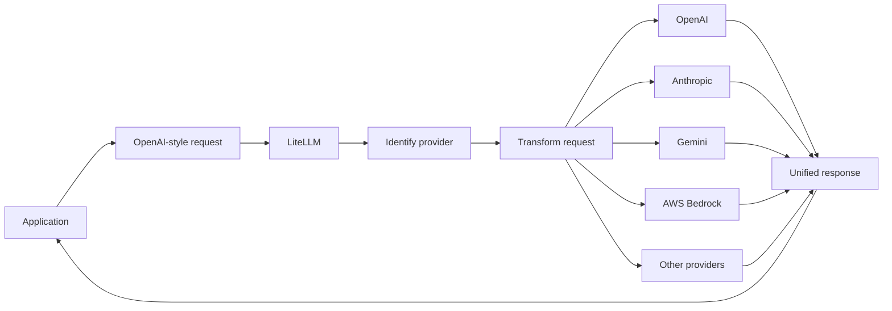

The application only needs to understand one interface while LiteLLM handles provider differences.

## 3. Overall Architecture

LiteLLM can be viewed as five layers:

| Layer | Responsibility | Important locations |
| --- | --- | --- |
| Access | Python API, HTTP API, and Dashboard | `litellm/__init__.py`, `litellm/proxy`, `ui/litellm-dashboard` |
| Request processing | Authentication, permissions, budgets, limits, and Hooks | `litellm/proxy/common_request_processing.py` |
| Routing | Deployment selection, retries, fallbacks, and load balancing | `litellm/router.py` |
| Provider adapters | Request transformation, response transformation, and provider calls | `litellm/llms` |
| Infrastructure | Cache, database, spend tracking, logs, and monitoring | `litellm/caching`, `litellm/proxy/hooks`, `litellm/integrations` |

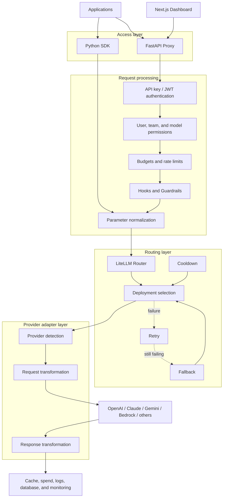

## 4. Python SDK Request Flow

The main SDK entry points are in `litellm/__init__.py` and `litellm/main.py`:

- `completion()` for synchronous text generation
- `acompletion()` for asynchronous text generation
- `image_generation()` for synchronous image generation
- `aimage_generation()` for asynchronous image generation

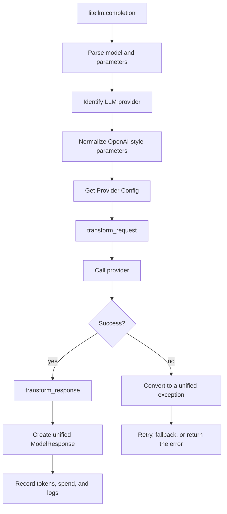

## 5. Proxy Request Flow

The Proxy is built with FastAPI. Important locations include:

- `litellm/proxy/proxy_server.py` for HTTP routes
- `litellm/proxy/auth/user_api_key_auth.py` for authentication and identity context
- `litellm/proxy/common_request_processing.py` for shared request processing
- `litellm/proxy/route_llm_request.py` for request dispatch

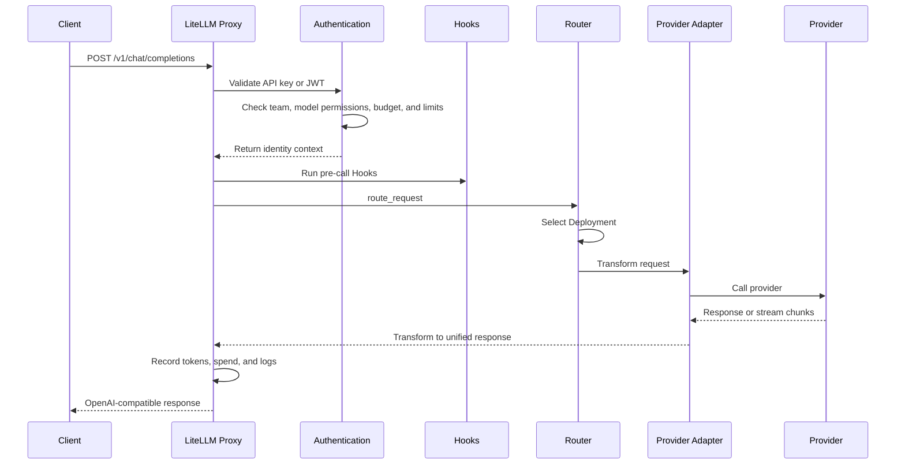

For a streaming request, the Proxy returns Server-Sent Events (SSE) chunks as they arrive instead of waiting for the complete response.

## 6. Router, Model Groups, and Deployments

A **Model Group** is the logical model name used by a client, such as `customer-service-model`.

A **Deployment** is a concrete upstream configuration. It normally includes a provider, real model name, API address, credentials, rate limits, weight, timeout, and pricing information.

```text
customer-service-model
├── OpenAI Deployment
├── Azure Deployment A
├── Azure Deployment B
└── Anthropic Deployment
```

The Router selects a Deployment according to availability, limits, cooldown state, and routing policy. A temporary error can trigger a Retry. An unavailable Deployment can be replaced by another Deployment. If the whole model group fails, the request can enter a Fallback model group.

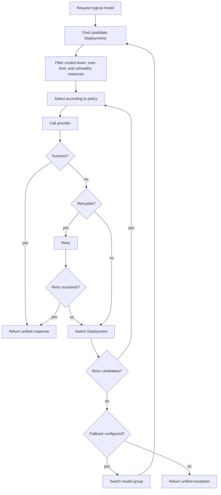

## 7. Multiple Upstreams for Image Generation

The Router provides `Router.image_generation()` and `Router.aimage_generation()`, so one logical image model can point to several image-generation Deployments.

```text
marketing-image-model
├── OpenAI image model
├── Azure image deployment
├── Vertex AI Imagen
└── Other image provider
```

The normal behavior is to choose **one upstream before the request**. If that upstream fails, LiteLLM can retry, switch Deployment, or enter a Fallback model group.

It does not normally call every upstream, produce several images, and choose the best image. That requires an additional orchestration service for parallel calls, image scoring, and result ranking.

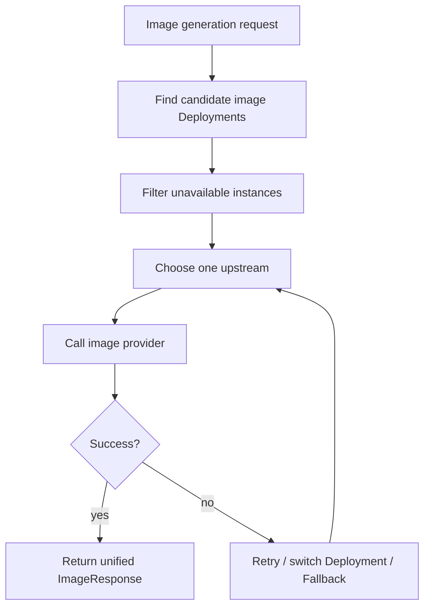

Provider fallback requires attention to image size, aspect ratio, transparent backgrounds, image editing, reference images, URL/Base64 responses, and pricing differences.

> **My application idea**
>
> Image-generation models may produce timeouts, rate-limit responses, or provider errors in real use. I plan to configure several upstreams for image generation. Round-robin or another policy can distribute normal requests across Deployments; when a selected upstream fails, Retry, health filtering, and Fallback can switch to another available upstream.
>
> This cannot guarantee that image generation will never fail, but it can reduce the impact of a single-provider outage. The upstreams in one model group should also support similar image parameters.

### Video generation and multiple upstreams

The Router also initializes `video_generation()`, `avideo_generation()`, video status, and video content endpoints, and video generation can enter the common fallback wrapper flow.

> **My further idea**
>
> Video generation can use a similar multi-upstream approach. The system can choose one available video Deployment when creating a task and try another upstream if task creation clearly fails.
>
> Video generation is usually a long-running asynchronous task, so status checks should not blindly round-robin between providers. After one provider accepts the task, status checks and downloads should stay bound to the provider and Deployment that created it. Otherwise the task may not be found, or the system may create duplicate videos and incur extra cost. In practice, multi-upstream routing is most useful before task creation and when creation fails; after creation succeeds, the task needs provider affinity.

## 8. Design Patterns in LiteLLM

### Adapter pattern

The adapter converts a unified request into a provider-specific request and converts the provider response back into a unified response.

```text
OpenAI-style request
      ↓
Provider Adapter
      ↓
Anthropic / Gemini / Bedrock format
      ↓
Unified ModelResponse
```

### Strategy pattern

The strategy pattern answers: “Which Deployment should be selected?” Random selection, round-robin, weighted routing, latency-aware routing, and usage-aware routing are examples of possible selection algorithms.

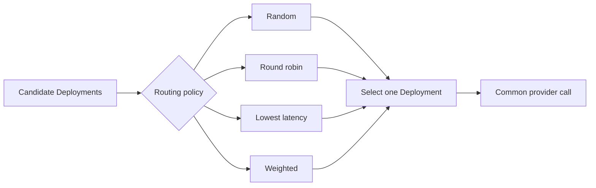

The routing algorithm is separate from the code that calls a particular provider. Exact policy names and endpoint support should be checked against the current LiteLLM version.

### Factory pattern

The factory pattern answers: “Given a Provider and an API type, which object or handler should be returned?”

`ProviderConfigManager` provides provider configurations for Chat, Embedding, Image Generation, Image Edit, Audio, Video, and other API types. This prevents the main call path from becoming a long sequence of Provider-specific `if/elif` branches.

```text
Model name
   ↓
Identify Provider
   ↓
ProviderConfigManager
   ↓
Get Provider Config
   ↓
Transform and call
```

> **A correction in my understanding**
>
> I initially thought that the factory pattern was an example of aspect-oriented programming, but they solve different problems. A factory chooses which object or handler to obtain. AOP decides which common behavior should run around a model call, such as authentication, logging, budgets, and spend tracking.
>
> `ProviderConfigManager` is closer to a Provider configuration factory. `Router.factory_function()` creates synchronous or asynchronous wrapper functions for different API call types and can route some calls through generic fallback handling. Its name does not make it AOP. Hooks, callbacks, dependency injection, and before/after processing are the parts that provide the AOP-style behavior. These patterns can cooperate in one request path, but they should not be treated as the same pattern.

### AOP-style Hooks

Authentication, logging, budgets, spend tracking, Guardrails, and observability cross many model interfaces. They are cross-cutting concerns.

LiteLLM uses Hooks, callbacks, FastAPI dependency injection, decorators, and shared request processors to implement an AOP-style design. It is more precise to call this an AOP-style Hook and callback design than a traditional full AOP framework.

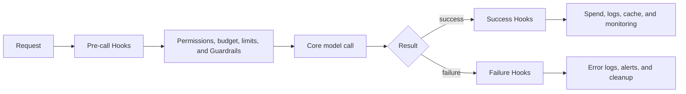

## 9. Multi-tenancy

Multi-tenancy means that several users, teams, or organizations share one LiteLLM Proxy while keeping permissions, budgets, and usage records logically separated.

Different teams can have different:

- Virtual API Keys
- Allowed models
- Rate limits
- Monthly budgets
- Spend records
- Logs and Guardrails

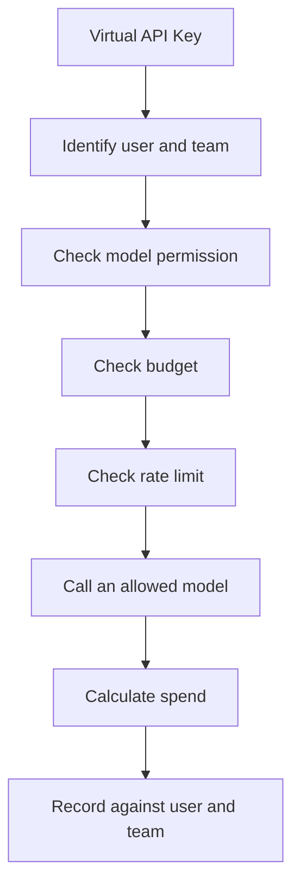

A simplified identity relationship is:

```text
Organization
    ↓
Team
    ↓
User
    ↓
Virtual API Key
    ↓
End User
```

This is normally application-level logical isolation. It does not necessarily mean that every tenant has a separate server or database. Higher security requirements can use separate LiteLLM instances, databases, networks, or cloud accounts.

## 10. Dashboard

The Dashboard is under `ui/litellm-dashboard` and uses Next.js and React. An important chat-call file is:

```text
ui/litellm-dashboard/src/components/llm_calls/chat_completion.tsx
```

The `makeOpenAIChatCompletionRequest()` function creates an OpenAI JavaScript client and points its `baseURL` to the LiteLLM Proxy. This means the Dashboard is also a Proxy client.

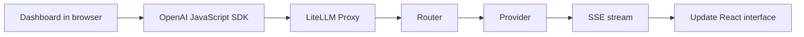

## 11. Source Reading Map

| Goal | File or directory | What to inspect |
| --- | --- | --- |
| Project scope | `README.md` | SDK, Proxy, and feature overview |
| Version and dependencies | `pyproject.toml` | Python version and dependencies |
| Public Python API | `litellm/__init__.py` | Top-level API exports |
| SDK flow | `litellm/main.py` | `completion()` and `acompletion()` |
| Provider adapters | `litellm/llms` | Request and response transformations |
| Provider configuration | `litellm/utils.py` | `ProviderConfigManager` |
| Proxy routes | `litellm/proxy/proxy_server.py` | FastAPI endpoints |
| Shared request flow | `litellm/proxy/common_request_processing.py` | Before/after request processing |
| Request dispatch | `litellm/proxy/route_llm_request.py` | `route_request()` |
| Router | `litellm/router.py` | Deployment, Retry, and Fallback |
| Authentication | `litellm/proxy/auth/user_api_key_auth.py` | API keys and JWT |
| Hooks | `litellm/proxy/utils.py` | Pre-call and post-call Hooks |
| Spend tracking | `litellm/proxy/hooks/proxy_track_cost_callback.py` | Spend and budget recording |
| Dashboard | `ui/litellm-dashboard` | Next.js administration UI |
| Deployment | `docker-compose.yml` | Container orchestration |
| Tests | `tests` | Router, Provider, and Proxy tests |

Line numbers can change between versions, so search for symbol and class names first.

## 12. Recommended Learning Order

1. Read `README.md`, `pyproject.toml`, and `docker-compose.yml` to understand the project boundary.
2. Enter `litellm/main.py` from `litellm/__init__.py` and follow `completion()`.
3. Choose one Provider under `litellm/llms` and inspect request and response transformations.
4. Start at `chat_completion()` in `proxy_server.py` and follow a Proxy request.
5. Read authentication, shared request processing, and `route_request()`.
6. Follow `Router.acompletion()`, Deployment selection, Retry, and Fallback.
7. Finally study budgets, rate limits, caching, Hooks, spend, logs, and the Dashboard.

For the first reading pass, track only `model`, `messages`, `provider`, `optional_params`, and `ModelResponse`. Do not try to understand every parameter at once.

## 13. What You Can Learn

- **Unified interface design:** designing a stable interface over many external services.
- **High availability:** Retry, Fallback, Cooldown, health checks, and load balancing.
- **Asynchronous and streaming systems:** `async/await`, asynchronous HTTP, SSE, and streaming chunks.
- **API Gateway design:** authentication, authorization, budgets, rate limits, audit, and multi-tenancy.
- **Configuration-driven design:** adding Deployments through configuration instead of changing business code.
- **Large-project reading:** following one call chain from an entry point instead of reading every file.
- **Testing:** mocking Providers and testing routing failures, Fallback, budgets, and permission boundaries.

## 14. Suggested Practice

Create a logical model called `my-chat-model` and configure a primary and backup Deployment. Verify that:

1. A normal request reaches the primary Deployment.
2. A timeout triggers Retry.
3. An unavailable primary switches to the backup Deployment.
4. The client continues using the same logical model name.
5. The final Provider, token usage, and spend are recorded.
6. Streaming and non-streaming responses both work.
7. A small test budget blocks requests after the limit is reached.
8. Two API Keys have different model permissions.

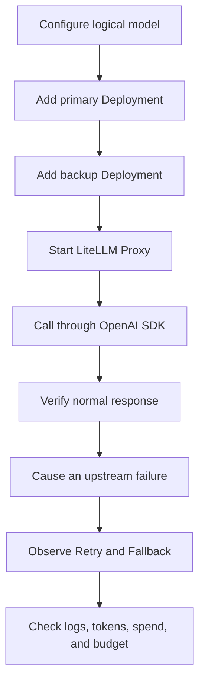

## 15. Conclusion

The complete LiteLLM request path can be summarized as:

```text
Unified access
  → Authentication
  → Permissions, budgets, and rate limits
  → Parameter normalization
  → Router selects a Deployment
  → Provider request transformation
  → Real model call
  → Unified response
  → Spend, logs, and monitoring
```

The three most important areas to understand are:

- `litellm/main.py`: the unified SDK call path.
- `litellm/router.py`: Deployment selection, Retry, Fallback, and Cooldown.
- `litellm/proxy`: a governed AI Gateway for multiple applications and teams.

For beginners, the most effective approach is to follow one `/v1/chat/completions` request through:

```text
chat_completion()
      ↓
user_api_key_auth()
      ↓
base_process_llm_request()
      ↓
route_request()
      ↓
Router.acompletion()
      ↓
Provider Adapter
      ↓
Real model service
```

Understand this main path first, then study caching, Guardrails, spend tracking, the Dashboard, and observability.

> Publication note: This article is based on a local checkout and should be reviewed again when the LiteLLM version changes. Provider capabilities, routing policy names, and endpoint support may differ between versions.
